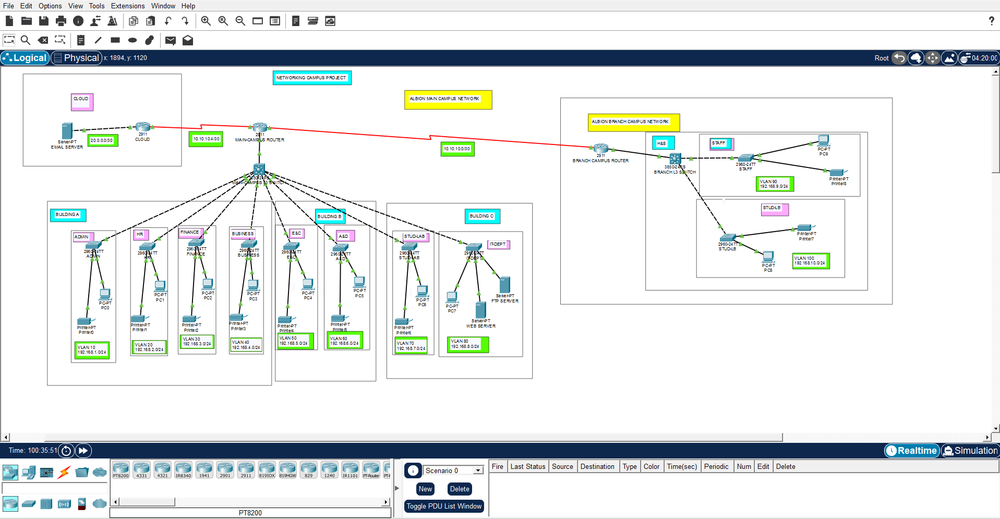
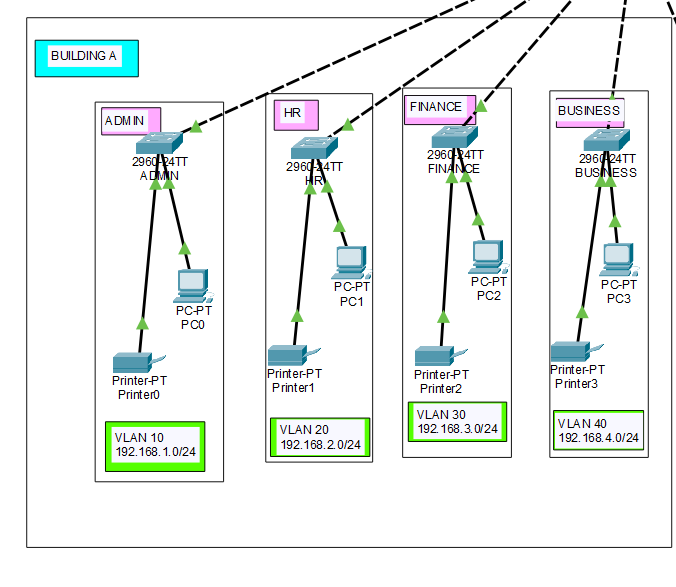
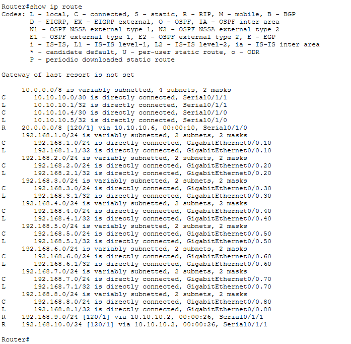
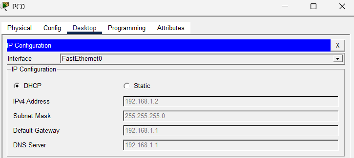
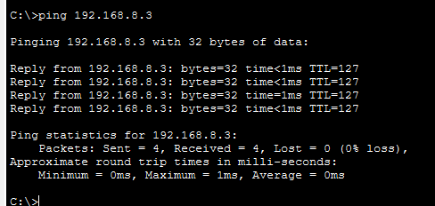

# University Campus Networking Project (Cisco Packet Tracer)

## 📌 Overview
This project simulates a **University/Campus Network** using Cisco Packet Tracer.  
It covers two campuses (Main + Branch) with multiple faculties and departments.  
The design demonstrates VLAN segmentation, RIP v2 routing, DHCP services, and server connectivity.

## 🏫 Network Requirements
- **Main Campus**
  - Building A: Admin, HR, Finance, Business (VLANs + DHCP)
  - Building B: Engineering & Computing + Art & Design
  - Building C: Student Labs + IT Department (Web Server, other servers)
  - External Email Server (Cloud)
- **Branch Campus**
  - Faculty of Health & Sciences (Staff + Student Labs)

## ⚙️ Configuration Highlights
- VLANs for each department/faculty  
- RIP v2 for internal routing  
- Static route for external email server  
- DHCP for Building A staff PCs  
- Servers hosted in IT Department + Cloud  

## 📂 Files
- `University-Campus-Networking-Project.pkt` → Main simulation file  

## 🚀 How to Run
1. Download the `.pkt` file  
2. Open in Cisco Packet Tracer (v8.x recommended)  
3. Explore VLANs, routing, and server connectivity  

## 📸 Project Screenshots

### 1. Campus Topology

### 2. Building A VLAN Configuration

### 3. RIP Routing Setup

### 4. DHCP Test

### 5. Server Connectivity

## 📑 License
Licensed under the MIT License.
